### 🏛 The Study
Software engineer building distributed backends in **Java & Spring Boot**, and the **Next.js** interfaces on top of them. Now: agentic AI systems, RAG support agents, healthcare booking APIs and community rescue apps.

### 🖼 The Gallery · things I've built
| | Project | What it is |
|---|---|---|
| 🟦 | [**pawpatrol-stray-rescue-app**](https://github.com/Hrishap/pawpatrol-stray-rescue-app) | Community stray-animal rescue — React Native + Expo, Supabase (Postgres/RLS/Realtime), EN/ML/HI, keyless OpenStreetMap |
| 🟨 | [**MoodMenu**](https://github.com/Hrishap/MoodMenu) | Mood-based recipe suggestions — Gemini AI, React, Tailwind, JWT auth, analytics |
| 🟥 | [**SwarmMind**](https://github.com/Hrishap/SwarmMind) | What if AI agents started a civilization? Multi-agent simulation |
| 🟪 | [**ParallelLives**](https://github.com/Hrishap/ParallelLives) | Explore alternate versions of your life |
| 🟩 | [**Ai-powered-image-generator**](https://github.com/Hrishap/Ai-powered-image-generator) | Next.js + TypeScript image generator |
| 🟧 | [**Heart-Disease-predictor**](https://github.com/Hrishap/Heart-Disease-predictor) | End-to-end heart disease classification (Jupyter) |

### 🛠 The Workshop · tech I use
            

Graduating 2026 · open to SDE / backend roles
